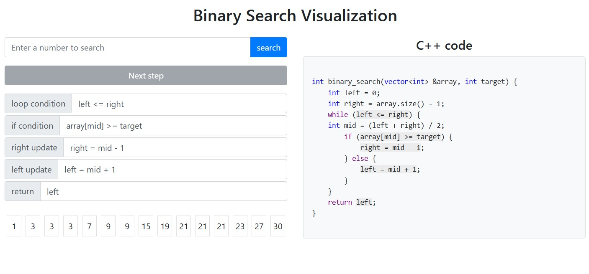

# Binary Search Visualization

A place for anyone who wants to see how binary search works.

Features:

- Binary search step-by-step visualization
- Dynamic C++ code display
- Can edit some details of binary search to see what happens

